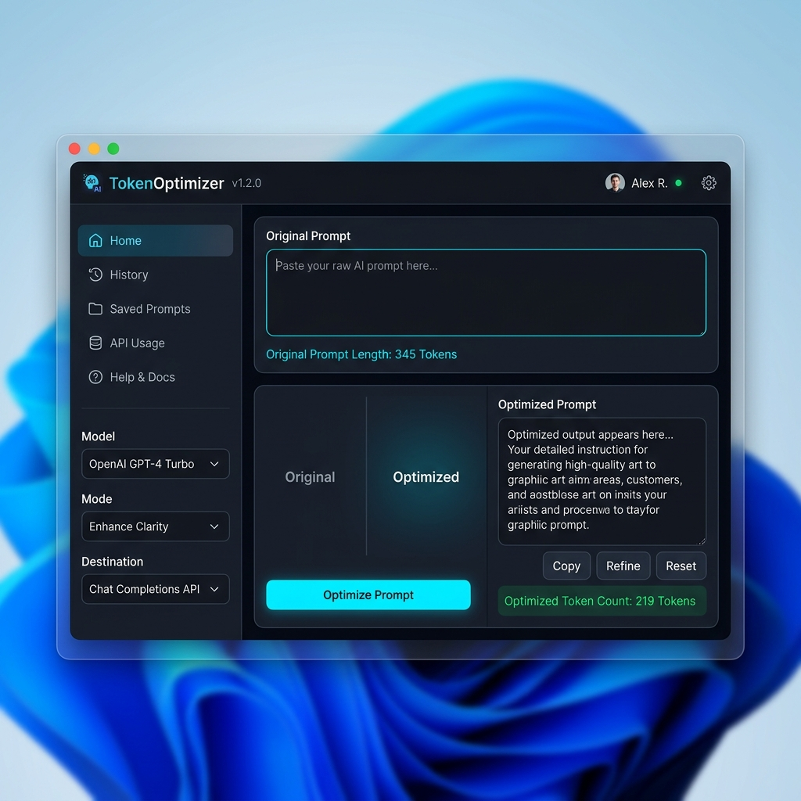

# 🚀 TokenOptimizer

**TokenOptimizer** is a professional-grade desktop application designed to optimize and compress AI prompts using local models via **Ollama**. It features a high-density UI, symbolic pre-encoding, and seamless integration with other applications.



## ✨ Key Features

- **🎯 4 Optimization Modes**:
  - **Light**: Refines clarity while maintaining original length.
  - **Optimized**: Balances compression and intent (default).
  - **Aggressive**: Telegram-style compression for maximum token savings.
  - **Symbolic**: Replaces common words with mathematical/logical symbols (`&`, `->`, `∀`).
- **🔗 Auto-Send Integration**: Automatically focus and inject optimized prompts into other windows (e.g., Browser, VS Code, Discord).
- **📜 Smart History**: Single-instance history window with search and chronological navigation.
- **⚡ Real-time Diagnostics**: Live token counters and compression percentage tracking.
- **🌐 Cross-Platform**: Native support for Linux, Windows, and macOS.
- **🔄 Auto-Updates**: Startup check against GitHub releases with built-in changelog viewer.
- **🌍 Global Localization**: Dynamic UI translation for EN, ES, FR, DE, IT, and PT.

## 🛠️ Installation

### 🐧 Linux (Recommended)
The easiest way is to use the automated setup script:
```bash
chmod +x setup.sh && ./setup.sh
```
This installs system dependencies (`xdotool`, `xclip`, `python3-tk`) and all Python requirements.

### 🪟 Windows / 🍎 macOS
1. Install [Ollama](https://ollama.com/).
2. Install Python dependencies:
```bash
pip install -r requirements.txt
```

## 📦 Compilation & Distribution

### 🐧 Linux
- **Standalone Binary**: `pyinstaller TokenOptimizer.spec`
- **Debian Package**: `./build_deb.sh` (Creates a `.deb` with auto-dependency management)
- **Portable AppImage**: `./build_appimage.sh`

### 🪟 Windows
Run the batch script on a Windows machine:
```cmd
compile_windows.bat
```

### 🍎 macOS
Run the shell script on a Mac:
```bash
./compile_mac.sh
```

## 📋 Requirements

- **Ollama**: Must be running locally (`ollama serve`).
- **Python 3.8+**: If running from source.
- **System Utils (Linux only)**: `xdotool` and `xclip` are required for window focus and clipboard features.

## ⌨️ Controls & Shortcuts

- **Enter**: Execute optimization.
- **Ctrl + Up/Down**: Navigate prompt history.
- **Ctrl + Plus/Minus**: Global UI zoom (font size).
- **Click Version**: View changelog and check for updates.

## 📄 License

This project is licensed under the MIT License - see the [LICENSE](LICENSE) file for details.

---
*Developed with ❤️ for the AI community.*